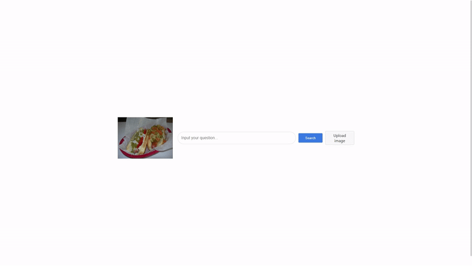

# 🦮 MIRe: Enhancing Multimodal Queries Representation via Fusion-Free Modality Interaction for Multimodal Retrieval

A retrieval framework that achieves modality interaction without fusing textual features during the alignment. Our method allows the textual query to attend to visual embeddings while not feeding text-driven signals back into the visual representations.

**Web demo**

## Install

Python 3.10

~~~bash
conda install pytorch==2.1.2 torchvision==0.16.2 torchaudio==2.1.2 pytorch-cuda=11.8 -c pytorch -c nvidia
pip install https://github.com/kyamagu/faiss-wheels/releases/download/v1.7.3/faiss_gpu-1.7.3-cp310-cp310-manylinux_2_17_x86_64.manylinux2014_x86_64.whl
pip install pylate
pip install -r requirements.txt
~~~

## Settings

1. Download the [pre-trained ColBERTv2 checkpoint](https://downloads.cs.stanford.edu/nlp/data/colbert/colbertv2/colbertv2.0.tar.gz) to `ckpts` and unzip the downloaded file to `ckpts/colbertv2.0`.

    We employ [ColBERTv2](https://github.com/stanford-futuredata/ColBERT) as a text retriever baseline.

2. Install python packages.

    ~~~bash
    pip3 install -r requirements.txt
    ~~~

3. Download downstream task datasets.

    We use four retrieval datasets curated from OK-VQA, ReMuQ, and E-VQA. You can download the dataset in the following links:

    - [OK-VQA (Wiki-11M)](https://github.com/prdwb/okvqa-release)
        Download annotation files to `data/okvqa`.

    - [OK-VQA (Google Search)](https://github.com/LinWeizheDragon/Retrieval-Augmented-Visual-Question-Answering?tab=readme-ov-file#download-datasets)
        In this dataset, questions in the annotation files include captions for images. Thus, we edit the questions to remove captions. See `dataset/vqa_ret.py` for details.

    - [ReMuQ](https://github.com/luomancs/ReMuQ)

    - [E-VQA](https://huggingface.co/datasets/BByrneLab/M2KR_Images/tree/main/EVQA)

## Dataset Construction via the Response-to-Passage Conversion: ViD2R

1. Download instruction data and image datasets from the following pages: 

    - [Visual instruction dataset](https://github.com/haotian-liu/LLaVA?tab=readme-ov-file#visual-instruction-tuning) (Here, download images with the dialogue dataset)

    - [LVIS-Instruct4V](https://huggingface.co/datasets/X2FD/LVIS-Instruct4V)

2. Pre-processing and neural filtering using a text retriever:
    
    You can skip the neural filtering step by modifying the code if you want to build the dataset fast.

    ~~~bash
    python3 -m runs.neural_filtering --data_paths path_to_data1 path_to_data2 --colbert_ckpt [directory_with_colbert_checkpoint] --save_path [path_to_save]
    ~~~

3. Converting responses to passages:

    We require a knowledge base (KB) and a text retriever to convert dialogues to retrieval tasks. We adopt 6M Wikipedia passages as the KB. You can download the passages in this [link](http://storage.googleapis.com/gresearch/open-vision-language/Wiki6M_ver_1_0.jsonl.gz).

    ~~~bash
    python3 -m runs.convert_tasks --data_path [path to pre-processed data] --colbert_ckpt [directory with colbert checkpoint] --db_pool [path to KB] --save_path data/vid2r/ViD2R.json
    ~~~

Please check `scripts/make_pretraining_data` as an example.

## Training MIRe

*First, set configure files!*

**Pre-training MIRe on the ViD2R datset**

~~~bash
export WANDB_API_KEY=[Your_WANDB_KEY]
CONFIG_PATH=cfgs/mire_train_vid2r.yaml

export CUDA_VISIBLE_DEVICES=0,1,2,3
NPROC=4

# Caching visual embeddings
python3 -m runs.run_visual_embedder --model_name openai/clip-vit-base-patch32 --data_path data/vid2r/ViD2R.json --batch_size 512 --image_dir data/vid2r/images

# Run training command
python3 -m torch.distributed.run --nproc_per_node=$NPROC train_retrieval.py --config_path "$CONFIG_PATH"
~~~

or 

After modifying the shell file `scripts/pretrain_mire_inbatch.sh` to your path, execute the following command:

~~~bash
bash scripts/pretrain_mire_inbatch.sh
~~~

This shell file evaluates zero-shot performance after training. If indexing has already been done, comment out the execution of run_indexer.

**Fine-tuning MIRe on the downstream task**

If you want to cache visual embeddings, set `image_cached` to True in the config file and execute `runs/run_visual_embedder.py` after slightly modifying the code.

~~~bash
export WANDB_API_KEY=[Your_WANDB_KEY]
CONFIG_PATH=[Path_to_config_file]

export CUDA_VISIBLE_DEVICES=0,1,2,3
NPROC=4

# Run training command
python3 -m torch.distributed.run --nproc_per_node=$NPROC train_retrieval.py --config_path "$CONFIG_PATH"
~~~

## Pre-Indexing

If you do not input `--mire_ckpt`, the following code loads the checkpoint of ColBERTv2.

~~~bash
CUDA_VISIBLE_DEVICES=0,1,2,3 python3 -m runs.run_indexer --exp_name [experiment_name] --n_bits [2|4|8] --dataset_name [okvqa|okvqa_gs|infoseek] --all_blocks_file [path to knowledge base] --mire_ckpt $CHECKPOINT
~~~

## Evaluation

If you do not provide `--mire_ckpt` and `--image_dir`, this following code use the text retriever (ColBERTv2)

~~~bash
python3 -m runs.evaluate_retrieval \
    --dataset_name [okvqa|okvqa_gs|infoseek] \
    --index_name [experiment_name].nbits=[n_bits] \
    --save_path [path to save result file] \
    --all_blocks_file [path to knowledge base] \
    --anno_file [path to test file] \
    --mire_ckpt $CHECKPOINT \
    --image_dir [directory to images]
~~~

## Web Demo

**Settings**
~~~bash
pip3 install flask flask_cors
curl -o- https://raw.githubusercontent.com/nvm-sh/nvm/v0.39.1/install.sh | bash
nvm install --lts
~~~

**Web Server Start**
~~~bash
cd searcher
npm install
npm start
~~~

**Search Engine Start**

Before you start this engine, check checkpoint path in this code.

~~~bash
python3 search_api.py
~~~